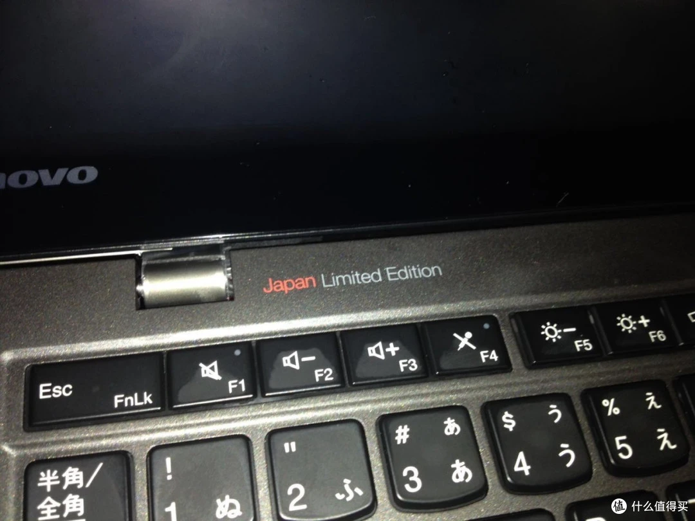
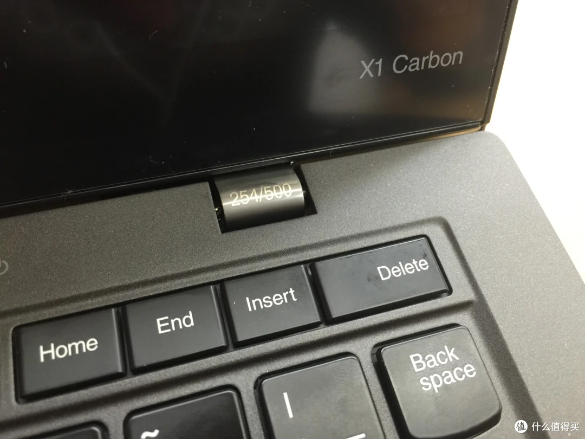
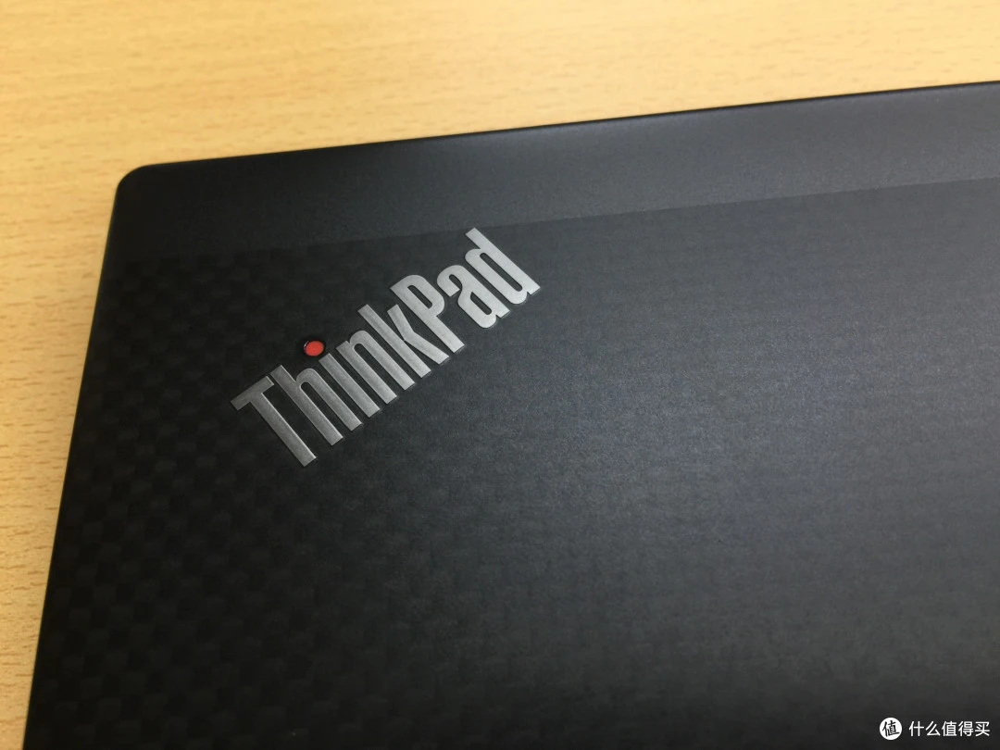
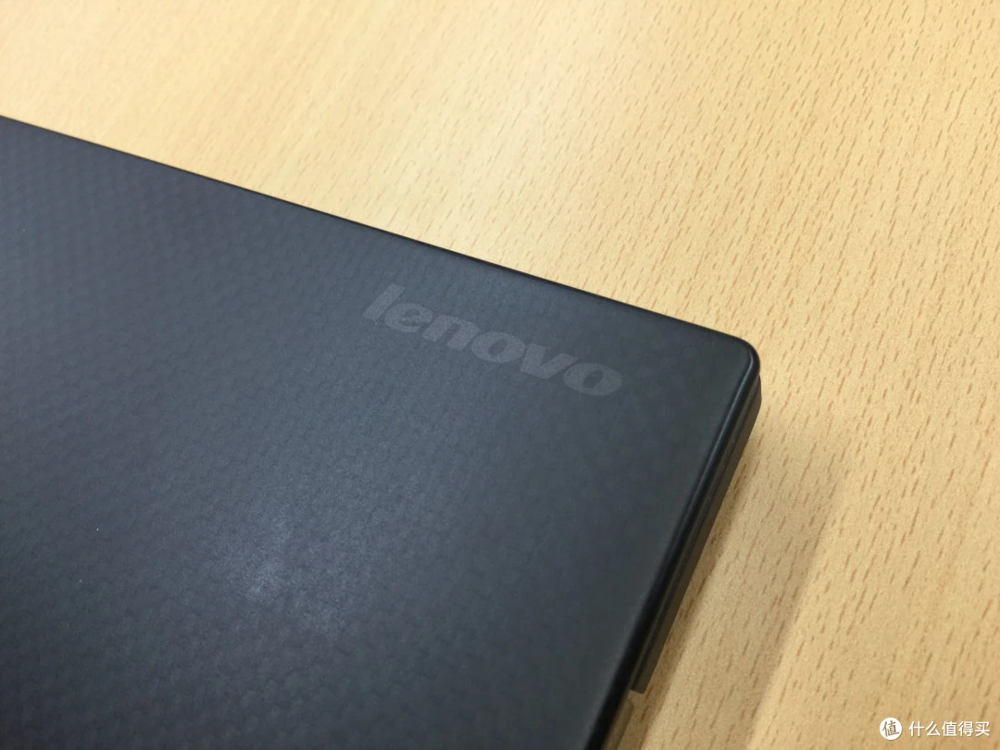
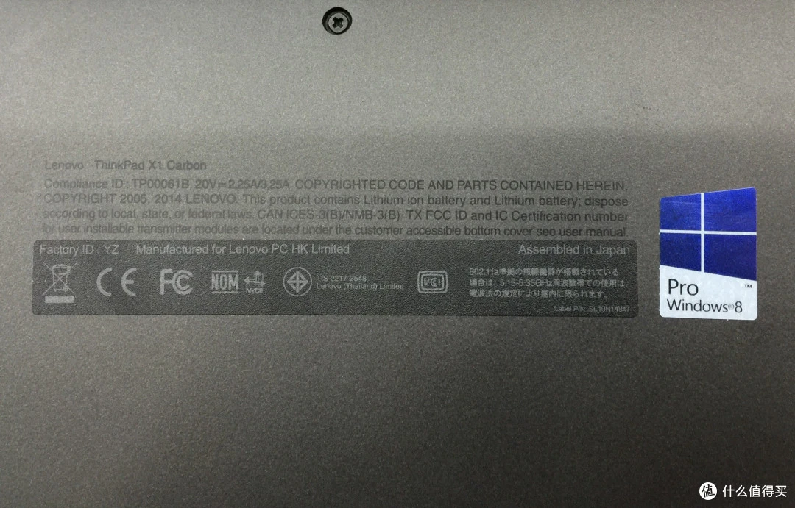
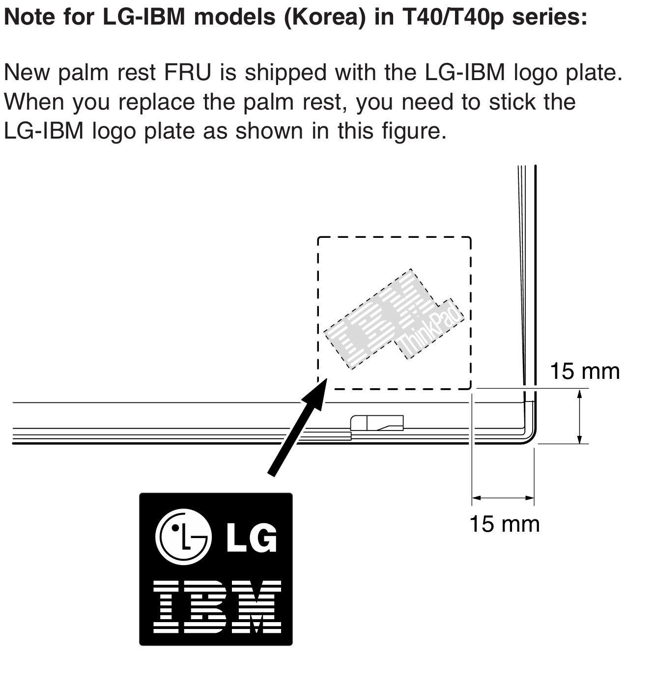

# ThinkPad的地区限定机型

ThinkPad作为一个全球化的品牌，一直为全世界的ThinkPad用户和粉丝提供全球均可购买的产品，但是在面对一些具有特殊需求的市场时，ThinkPad也乐意于设计生产符合当地需求的产品，这里就对于此做一个简单的介绍。

*本文至少暂时是一个存根，旨在展现平台能力，笔者的目标是最后使其成为足够丰富的文章。*

## 日本限定

（Placeholder）

作为一个从日本走向世界的团队，ThinkPad为了日本市场做了不少独特产品。其中大部分机器都是一些“小玩意”，比如长期作为日本独占系列的2系列和被美誉为小蝴蝶机的S30。

在联想时代，ThinkPad逐渐的不再为日本市场提供独特机型，最后一个明确的Japan Only机型是G50。与此同时，联想收购IBM个人电脑业务的协议并未包含IBM在当地的工厂（此前参与生产ThinkPad的IBM藤泽事业所按说也早已随着硬盘业务一起卖给日立），这也意味着ThinkPad将不会在日本当地生产。但是，ThinkPad和日本制造的姻缘远未结束，事情的转机出现在了2011年，这一年联想收购了NEC个人电脑业务51%的股份，而NEC在日本国内是有个人电脑生产基地的。

在完成收购之后，双方很快就放出风声说正在米泽进行前期准备，将会在米泽生产ThinkPad。

2013年的ThinkPad X1 Carbon 20周年纪念机是联想第一次在NEC米泽生产机器。2015年开始米泽开始固定生产X和X1系列，之后也生产了ThinkCentre和ThinkSystem。

为表纪念，联想还生产了一批“THINKPAD 国内生産開始記念 THINKPAD X1 CARBON JAPAN LIMITED EDITION”纪念机，A面采用独占的碳纤维纹理，C面喷花，屏轴刻字，也是尽显尊贵。

NEC在自己生产ThinkPad的同时，也充分发挥拿来主义，通过微调模具等方式制造了大量NEC牌ThinkPad或者IdeaPad，其本身就能生产的X系列是“重灾区”，亦有L系列和Ts系列被捉去魔改的报告。

另外，NEC米泽也是ThinkPad P1系列的ODM设计方，虽说最终仍然是由联宝生产。

*（開発拠点としての役割では、法人向けPCである「Mate」「VersaPro」、個人向けPCである「LAVIE」に加えて、モバイルワークステーションのフラグシップモデルとしてグローバル展開している「ThinkPad P1」の開発も行なっている。NEC PCの飯田執行役員は、「ThinkPadの開発は、神奈川県みなとみらいの大和研究所で行なっているが、ThinkPad P1だけは、米沢でNECブランドのPCの開発者が担当している。軽量化のノウハウを生かしており、米沢事業場と大和研究所との緊密な連携も進んでいる」という。）*

## LG-IBM

*本段参考了Laptop Retrospective的*[*文章*](https://laptopretrospective.com/laptops/the-strange-history-of-lg-and-thinkpad-the-story-of-lg-ibm/)*。*

1996年，LG和IBM建立合资公司，共同在韩国推出产品，IBM借由这个合资公司向韩国提供ThinkPad等产品，而LG则自行设计X-Note并以合资公司的名义销售。

自然的，当年的韩国版ThinkPad也不是粘贴IBM ThinkPad徽标，而是粘贴LG IBM徽标。

同时LG IBM也作为代工厂生产了不少ThinkPad，诸如X系列和R系列。就是风评不佳，普遍认为不如长城国际，堪比墨西哥。

2004年6月，LG和IBM宣布将会和平分手，双方均宣称和两家公司牵扯进去的贿赂丑闻无关。

## PRC Only

国行特供机的历史虽说没有日版特供机那么复杂，但是也是充满了故事，值得好好说道。

首先是S系列的故事。10年作为Es出道、12年正式独立出来的新S系列曾经是ThinkPad的一个偏前卫的中低端型号，以做了当时许多一般ThinkPad不敢做的设计在历史上也是留下了一笔。随着ThinkPad基本完成了切换为超极本的进程，S系列也逐渐变成了PRC Only的标记，用作将部分机器改名后在零售端上市，切割渠道方便区分定价。

15年刚开始的时候S系列的矩阵长这样：

* S1：ThinkPad Yoga 12改名
* S2：悬空
* S3：ThinkPad Yoga 14改名
* S4：悬空
* S5：ThinkPad Yoga 15改名

在2016年，S5在ThinkPad Yoga 15被砍后成为了当年的ThinkPad 游戏本的型号之一（也就是大名鼎鼎的黑将S5，又名E560p），随着该机器两代而亡悬空。

S3在14寸Yoga砍掉后于19年短暂复活，作为国行E490s的零售版，后来20年也出过基于E14 Gen1 的S3，此后悬空。

S1则是随着X390 Yoga的推出也成为悬空号码。

反倒是S2在2016年作为零售版ThinkPad 13（后来的L13系列）的国行零售版后一直被套娃到了现在，虽说水花不大但是确实没有被砍。

上面的S系列更多是渠道区分，而ThinkPad给中国单开型号那就得等20年后了。

或许大家都不知道的是，ThinkPad E14 ICL是第一个彻头彻尾的PRC Only ThinkPad。关于为什么会做这个机器一直是个谜，联想似乎也没做过多的宣传。

neo14改变了 PRC Only机器的格局

T14p Gen2成为了PRC Only的一个分水岭，也是反向输出第一机。

E14超能版的双管风扇展现了大陆ThinkPad团队在已有条件下的小巧思

X14是PRC Only机器的一个新的巅峰，意味着大陆团队已经不再局限于做一个小钢炮，而是向着高性能轻薄本狂飙突进。

